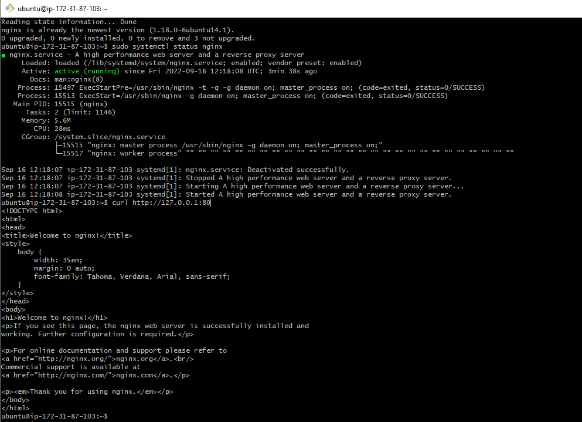
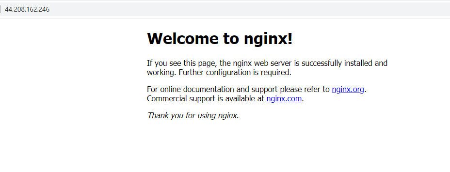
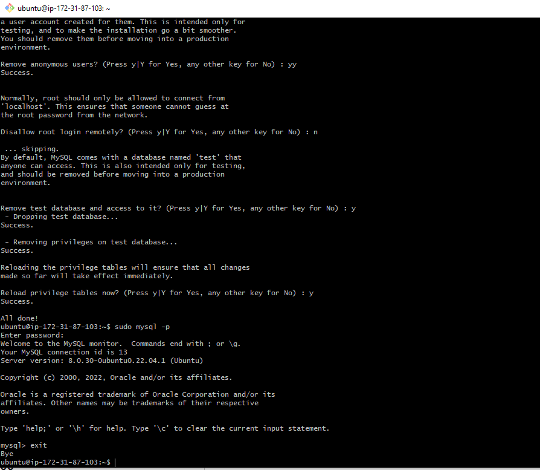
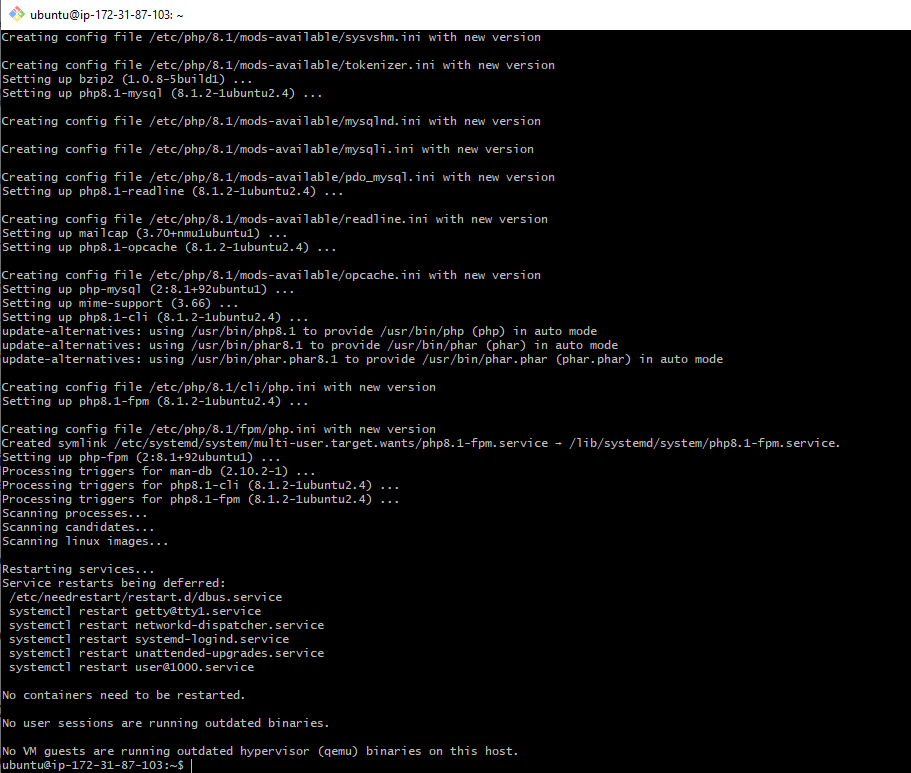
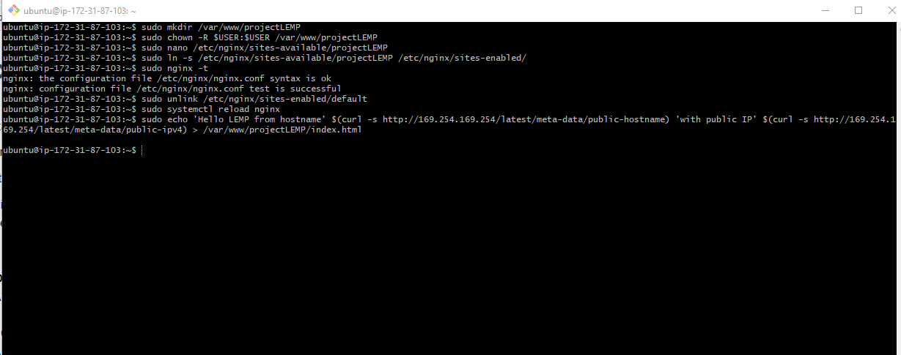
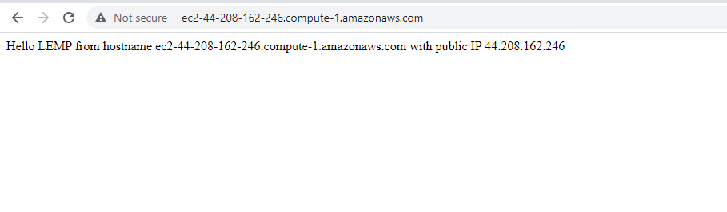
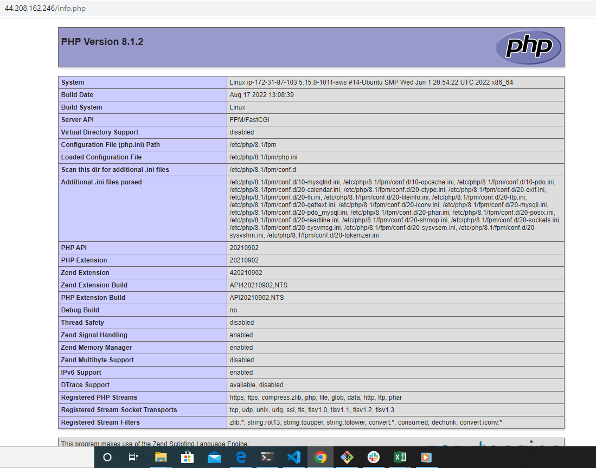
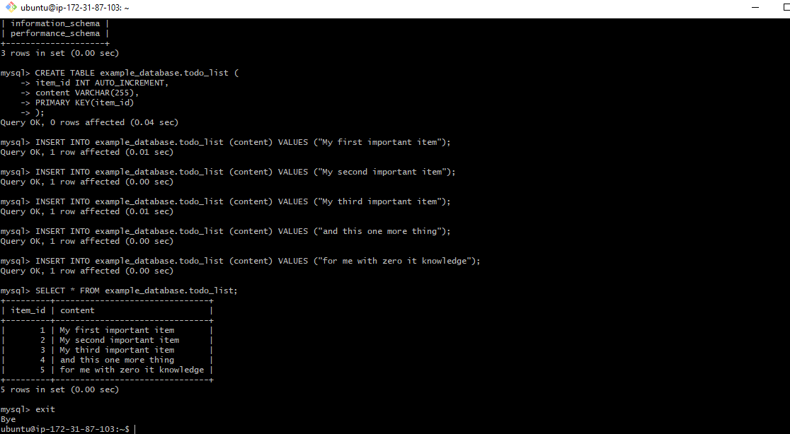
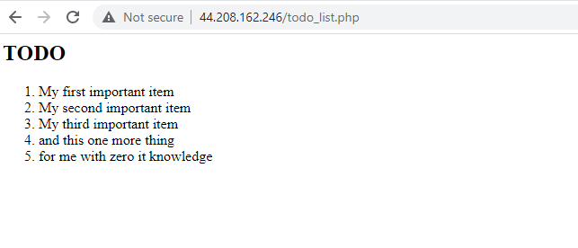

## Project 2 Documentations

Step 1 – Installing the Nginx Web Server

Commands:

- sudo apt update (updating server package index)
- sudo apt install nginx (nginx installation)
- sudo systemctl status nginx (confirm nginx installation)
- curl http://127.0.0.1:80 (server access)

- http://44.208.162.246/:80

Step 2 — Installing Mysql

Commands:

- sudo apt install mysql-server (install mysql)
- sudo mysql (mysql login)
- exit (mysql logout)
- sudo mysql_secure_installation (run interactive script)
- sudo mysql -p (mysql login with password)
- exit (mysql logout)

Step 3 – Installing PHP

Commands:

- sudo apt install php-fpm php-mysql (install fpm and mysql)

Step 4 — Configuring Nginx to Use PHP Processor

Commands

- sudo mkdir /var/www/projectLEMP (create root web directory)
- sudo chown -R $USER:$USER /var/www/projectLEMP (assign directory ownership)
- sudo nano /etc/nginx/sites-available/projectLEMP (new configuration file in nginx)
- sudo ln -s /etc/nginx/sites-available/projectLEMP /etc/nginx/sites-enabled/ (activate configuration)
- sudo nginx -t (syntax error test)
- sudo unlink /etc/nginx/sites-enabled/default (disable default nginx host)
- sudo systemctl reload nginx (nginx reload)
- sudo echo 'Hello LEMP from hostname' $(curl -s http://169.254.169.254/latest/meta-data/public-hostname) 'with public IP' $(curl -s http://169.254.169.254/latest/meta-data/public-ipv4) > /var/www/projectLEMP/index.html (create index.html file)

- http://44.208.162.246:80

Step 5 – Testing PHP with Nginx

Commands:

1. sudo nano /var/www/projectLEMP/info.php (create a test php file)
2. <?php
phpinfo(); (php code)

3. http://44.208.162.246/info.php

Step 6 — Retrieving data from MySQL database with PHP

Commands:

- sudo mysql (connect to mysql with root account)
- mysql> CREATE DATABASE `example_database`; (create a new database)
- mysql>  CREATE USER 'example_user'@'%' IDENTIFIED WITH mysql_native_password BY 'password'; (create username and password for new database created)
- mysql> GRANT ALL ON example_database.* TO 'example_user'@'%'; (grant user permission)
- exit (exit mysql)
- mysql -u example_user -p (login to mysql with username and password)
- mysql> SHOW DATABASES; (access to database confirmation)
- mysql> INSERT INTO example_database.todo_list (content) VALUES ("My first important item"); (databse content)
- mysql>  SELECT * FROM example_database.todo_list; (database content)

- exit (exit mysql)
- nano /var/www/projectLEMP/todo_list.php (create new php file)
- <?php
$user = "example_user";
$password = "password";
$database = "example_database";
$table = "todo_list";

try {
  $db = new PDO("mysql:host=localhost;dbname=$database", $user, $password);
  echo "<h2>TODO</h2><ol>";
  foreach($db->query("SELECT content FROM $table") as $row) {
    echo "<li>" . $row['content'] . "</li>";
  }
  echo "</ol>";
} catch (PDOException $e) {
    print "Error!: " . $e->getMessage() . " ";
    die();
} (file content)
- http://44.208.162.246//todo_list.php

